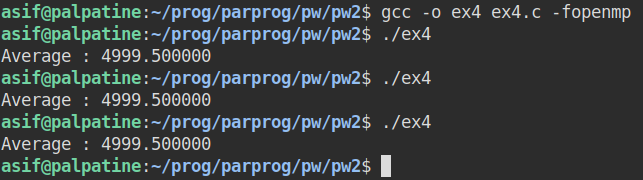

# Parallel Programming

## PW 2 - Asif Mammadov


## 1. Warm up part one: parallel regions

Let us consider the following code:

```c
#include <stdio.h>
#include <omp.h>

int main() {
  #pragma omp parallel 
  printf("Hello\n");
  printf("World\n");
  return 0;
}
```


#### 1. Compile this program without the -fopenmp option and run it. What do you observe?

The program is compiled. And if we run it, we see the "Hello" string on line 1 and "World" strings displayed on the 2nd line. As we didn't include -fopenmp flag the code was executed sequentially.


#### 2. Compile  this  program  with  the  -fopenmp  option,  and  run  it.  What  is  the  default  number  of threads? 

The program is compiled and run. We see the "Hello" and "World" strings displayed 4 and 1 times respectively. This time the code was compiled with -fopenmp flag deducing that the code is run in parallel. The default number of threads is equal to the number of cores the machine could provide. In my case it is 4.


#### 3. Change  the  number  of  threads  dynamically  by  setting  the  value  of  the  environment  variable  OMP_NUM_THREADS to  the  desired  number  of  threads  (we  didn’t  study  the  OpenMP environment variables in class yet, but this one is handy).  


#### 4. Change  the  number  of  threads  statically  using  the  num_threads(n)  clause  of  the  parallel directive. Which directive did you write?  
We add num_threads(n) clause to the #pragma omp parallel to specify number of threads. n is the integer representing the specified number.

Example:

```c
int main() {
  #pragma omp parallel num_threads(2)
  printf("Hello\n");
  printf("World\n");
  return 0;
}
```


#### 5. Can the word "World" be displayed before the word "Hello"? If so, in which case? If no, why?

No, not in this example. Because the parallel execution was only applied to the line printing "Hello". String "World" will always appear after "Hello".

#### 6. Modify the program so that each thread runs both printf.

We just need to put the part of the code that needed to run in parallel into the block.

```c
#include <stdio.h>
#include <omp.h>

int main() {
  #pragma omp parallel
  {
    int tid = omp_get_thread_num();
    printf("---Thread %d\n", tid);
    printf("Hello\n");
    printf("World\n");
  }
  return 0;
}
```


## 2. Warm up part two: for loop partitioning

```c
#include<stdio.h>
#include<omp.h>

int main() {
  int i, tid;
  #pragma omp parallel private(id)
  {
    tid = omp_get_thread_num();
    #pragma omp for
    for (i = 0; i < 20; i++) {
      printf("Thread nb %d execute index=%d \n", tid, i);
    }
  }
  return 0;
}
```

#### 1. Compile this program with the -fopenmp option, and run it. What is the role of the OpenMP for directive?

Due to for directive the for iteration was distributed among threads. Here we can see that 20 calls were divided between 4 threads giving each thread 5 executions. By default the for directive uses the static scheduling (dividing the code equally and neglecting the load difference).


#### 2. To dynamically adjust the number of  threads,  set the  value  of  the OMP_NUM_THREADS environment variable and observe the changes when the loop is executed.

When we specifiy the number of threads to 2, the `for` directive now divides the code between the threads 0 and 1.


If we specify the number of threads to 3, the code will be divided between threads 0, 1 and 2. As 20 is not fully divisible without the reminder, threads 0, 1 and 2 will get 7, 7 and 6 respectively.


## 3. Warm up part three: work sharing and execution time

Let us consider the following code: 

```c
#include <stdio.h>
#include <omp.h>
#define SIZE 10000
int main()
{
  int i, tid;
  long t_ref, t_end;
  double a[SIZE], b[SIZE], c[SIZE];
  for (i = 0; i < SIZE; i++)
    a[i] = b[i] = i;
  #pragma omp parallel private(tid)
  {
    tid = omp_get_thread_num();
    if (tid == 0)
      printf("Nb threads = %d\n", omp_get_num_threads());
    printf("Thread %d: starting...\n", tid);
    t_ref = omp_get_wtime();
    #pragma omp for 
    for (i = 0; i < SIZE; i++){
      for (int k = 0; k < 1000000; k++); //delay
      c[i] = a[i] + b[i];
    }
    t_end = omp_get_wtime();
  }
  printf("Execution time = %ld\n", (t_end - t_ref));
  return 0;
}
```

#### 1. What does this program do?

The program sums up the values of arrays a and b with the size of 10,000 elements into the array c. The execution time is printed at the end.

#### 2. What are the instructions executed by a single thread? By all threads?

Firstly, before the parallelization block, the default thread (thread 0)  declares the variables and assigns the values to arrays a and b. Inside the omp parallel block the new threads are created and each of them execute the code inside this block, except the omp for block. Inside the omp for, the execution is statically divided between the existing threads and each thread executes its own chunk. After the parallel part has ended, the default thread prints the execution time log.

#### 3. What is the role of the OpenMP for directive?

`for` directive distributes the execution of for loop between the existing threads. If the scheduling is not specified, the distribution will occur statically. In other words, each thread will have more or less equal amount of executions.

#### 4. What is the scope of i and tid variables? What is the scope of a, b and c variables?

`i` and `tid` are local for each thread. By default the variables are shared between the threads. `tid` is local because it is passed with private clause. `i` is local due to `for` directive distribution.

As was mentioned previously, the variables are shared by default. Thus, variables a, b and c are shared and can be accessed by all threads.

#### 5. To dynamically adjust the number of  threads,  set the  value  of  the OMP_NUM_THREADS environment variable and observe the changes in execution time.

Apparently, more threads used provide better performance in time.

| N threads | Time (s) |
| :-------: | :------: |
|     1     |    18    |
|     2     |    9     |
|     3     |    6     |
|     4     |    5     |


# 4. Exercise

Write  a  C  program  that  performs  the  average  of  elements  of  an  array.  Parallelize  that  program  with OpenMP. 

```c
// The code is written incorrectly to show the problem and to answer the following question.
#include <stdio.h>
#include <omp.h>

#define SIZE 10000
int main()
{
  int a[SIZE];
  int sum = 0;
  for (int i = 0; i < SIZE; i++)
    a[i] = i;

  #pragma omp parallel
  {
    #pragma omp for
    for (int i = 0; i < SIZE; i++)
      sum += i;
  }
  printf("Average : %f\n", 1.0 * sum / SIZE);
  return 0;
}
```

#### 1. What do you observe when the program is executed several times? 

The output is different in each execution and it is not correct. The reason is due to potential data race happening between the threads.


#### 2. To have a correct answer you should use the reduction clause, modify the program and observe the changes after using reduction clause.

While using reduction, we eliminate the problem of data race. Each thread will have their local sum variable, and these variables will be added up at the end of for loop. Therefore, now we see that the outputs are always the same and the result is correct.

```c
#include <stdio.h>
#include <omp.h>

#define SIZE 10000
int main()
{
  int a[SIZE];
  int sum = 0;
  for (int i = 0; i < SIZE; i++)
    a[i] = i;

  #pragma omp parallel
  {
    #pragma omp for reduction(+:sum)
    for (int i = 0; i < SIZE; i++)
      sum += i;
  }
  printf("Average : %f\n", 1.0 * sum / SIZE);
  return 0;
}
```



