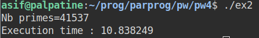
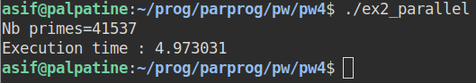
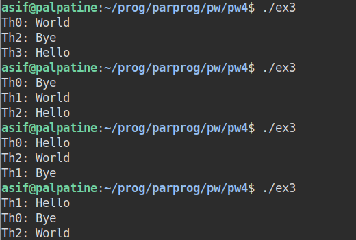
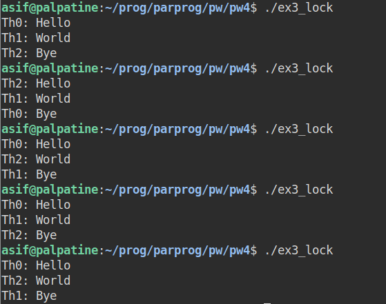

# Parallel Programming

## Practical Work 4 - Asif Mammadov

*The codes can be found in the same folder with this report.*


## 1. Number of Threads

Study and correct the following code using two different approaches. You are only allowed to add OpenMP directive without the reduction clause.

```c
int main()
{
  size_t nb_threads = 0;
  #pragma omp parallel
  {
    nb_threads++;
  }
  printf("nb_threads = %zu\n", nb_threads);
}
```

The problem here is that 'nb_threads' is not synchronized between the threads, which leads to data race and possiblity of incorrect answer. If we execute this program 10 times we would see that nb_threads gives the different answers (correct answer is 4).


* ##### Approach #1 : Using atomic directive

  Using atomic directive in front of increment of 'nb_threads' executes this line atomically, ensuring the synchronization between threads.

  So the output will be the following:
  

* ##### Approach #2 : Using critical directive

  Putting the increment of 'nb_threads' to the critical block will make the line be accessible by only one thread at a time.

  The output:

  


## 2. First Prime Numbers

Study and parallelize the following code:

```c
#include <stdio.h>
#include <omp.h>
#include<stdbool.h>

#define PRIME_MAX 500000
#define PRIME_MIN 3
#define N 100000

int main()
{
  size_t primes[N], nb_primes = 0;
  size_t divisor;
  bool is_prime;
  double start_time, end_time;

  start_time = omp_get_wtime();
  for (size_t i = PRIME_MIN; i < PRIME_MAX; i += 2)
  {
    is_prime = true;
    divisor = PRIME_MIN;
    while ((divisor < i) && is_prime)
    {
      if ((i % divisor) == 0)
        is_prime = false;
      divisor += 2;
    }
    if (is_prime)
    {
      primes[nb_primes] = i;
      nb_primes++;
    }
  }
  end_time = omp_get_wtime();
  printf("Nb primes=%zu\nExecution time : %lf\n", nb_primes, end_time - start_time);
}
```

The code counts the number of prime numbers in `PRIME_MIN` and `PRIME_MAX` range and saves these numbers in an array. With the defined values above the machine has executed the code in 10.84 s.



We can implement parallelism in the code by using omp for (for the "for" loop) and omp atomic directive (for the "nb_primes" variable). See the `ex2_parallel.c` in the same folder.

As a result, we get the execution time 4.97 s., more than double performance.




## 3. Synchronization using lock

Consider the following code:

```c
#include <omp.h>
#include <stdlib.h>
#include <stdio.h>
int main()
{
  int p;
#pragma omp parallel sections default(shared)
  {
#pragma omp section
    {
      p = omp_get_thread_num();
      printf("Th%d: Hello\n", p);
    }
#pragma omp section
    {
      p = omp_get_thread_num();
      printf("Th%d: World\n", p);
    }
#pragma omp section
    {
      p = omp_get_thread_num();
      printf("Th%d: Bye\n", p);
    }
  }
  return 0;
}
```


#### 1. Compile the program, and observe the behavior over multiple runs. What do you observe?

We get different order of section execution by different threads.




#### 2. Modify the program and use locks in order to obtain a correct execution. (Note: you need two locks to obtain the correct behavior).

Indeed, 2 locks were needed to execute 3 sections in the needed order. For the code, see the `ex3_lock.c` in the same folder with this report.

As a result, now we get the correct order:



