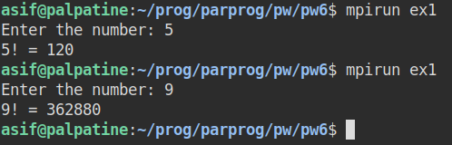
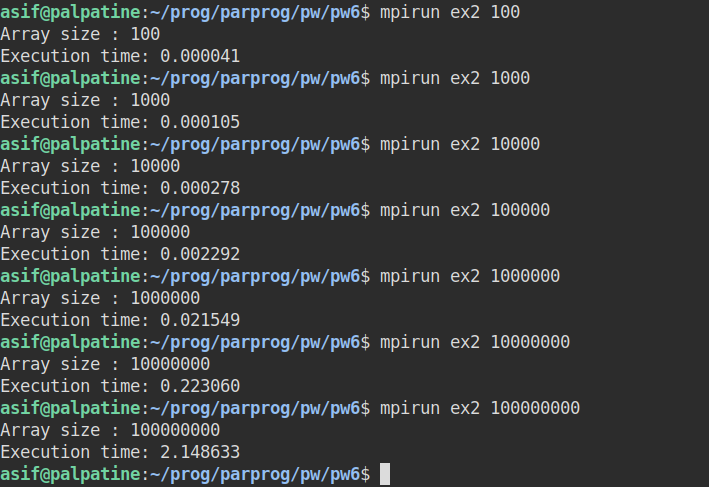
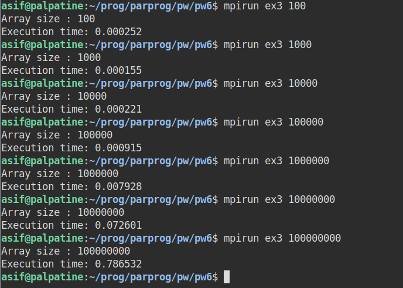

# Parallel Programming

## Practical Work 6 - Asif Mammadov

*All the codes are available in the folder with this report.*

## Exercise 1 

##### Write  an MPI  program  with  two  processes  in  such  a  way  that  the  process  0 reads an integer number using scanf. Process 0 sends the number to process 1, which calculates the factorial of the number and returns the results to process 0.

## Exercise 2

##### Consider that process 0 have an array of integer numbers where we should compute the factorial of all the elements in the array. Modify the program in order to send the array to process 1 that computes all the factorials and return the results to process 0.

## Exercise 3

##### Consider  that  we  have  n  processes,  modify  the  program  in  order  to  distribute  the  calculation  over  all available processes and measure the gain in execution time compared to exercise 2.

As we can see from the results, the gain from the execution of 1e8 element is equal to 2.148633/0.786532 = **2.73**. The increase of almost 3 times with 4 processes runned.