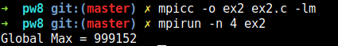

# Parallel Programming

## PW 8 - Asif Mammadov

*The codes can be found in the same folder with this report*

## Exercise 1

Write a parallel MPI program that computes the maximum of elements in an array. The process 0 initializes the array with random numbers. 

The code generates an array of size 1000 with random integer values.

## Exercise 2

Re-Write the parallel program that computes the max of elements in an array by using MPI_Reduce.

